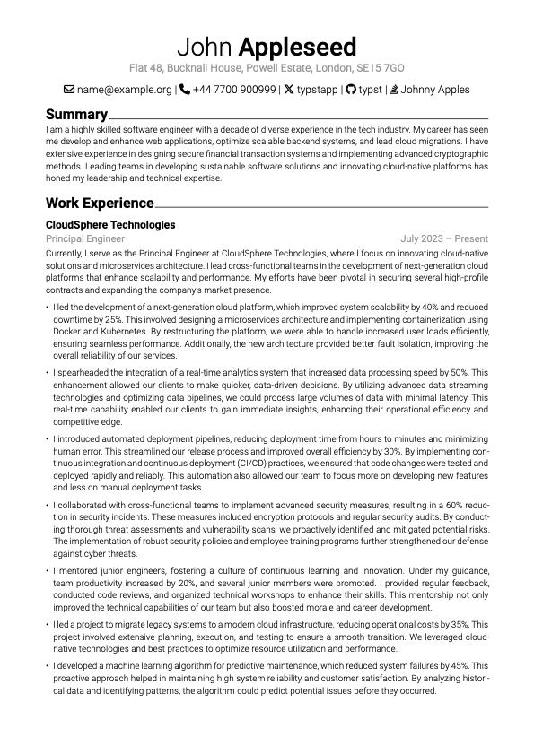
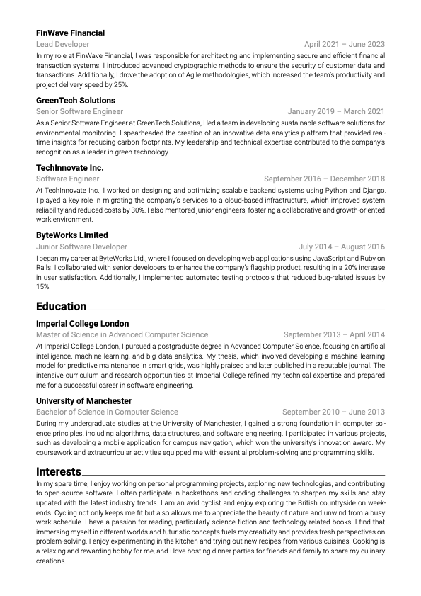

# curriculum-vitae
This is a CV template for [typst](https://typst.app) inspired by the [Awesome CV](https://github.com/posquit0/Awesome-CV) template for LaTeX.

The content of the sample CV was all generated by ChatGPT, apart form the GitHub, LinkedIn and Stack Overflow profiles which are mine.

## Set Up
1. [Download the Font Awesome _Free For Desktop_ fonts](https://fontawesome.com/download) and put them in the `fonts` folder.
2. Make sure [Roboto](https://fonts.google.com/specimen/Roboto) is installed as a system font or is in the `fonts` folder.

## How to Use
`typst compile --font-path fonts sample.typ`
